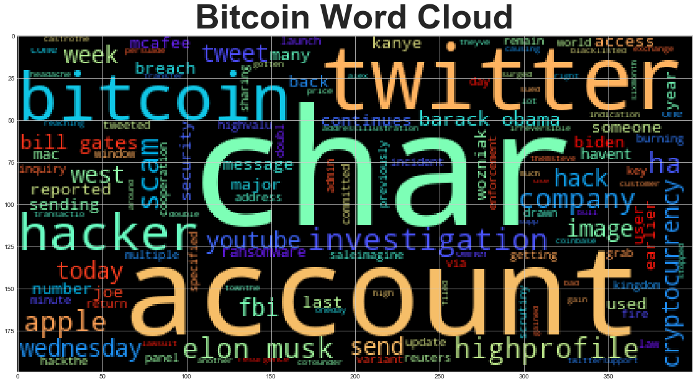
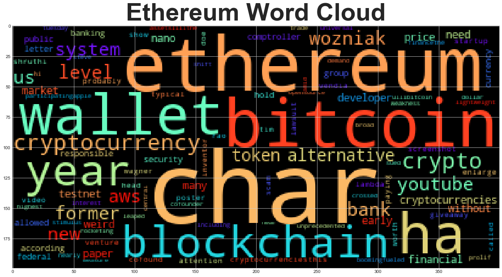

# Tales-from-the-Crypto
Natural Language Processing

This document compares Bitcoin to Ethereum using Natural Language Processing to determine the sentiment and named entity recognition from news articles.

## Sentiment Analysis

Based on the review of multiple news articles, Ethereum has higher postive sentiment.

* Ethereum has a higher positive mean 0.072 versus Bitcoin 0.046

* Bitcoin has the highest negative score with a max negative score 0.277000	 versus Ethereum 0.177000

* Ethereum has the highest positive score with a max positive score 0.226000 versus Bitcoin 0.149000

The negative view of Bitcoin maybe because it is more well known, therefore more people know the negative aspects of Bitcoin. I'd never heard of Ethereum until this year.

## Natural Language Processing
### Word Clouds

Below is a word cloud for both Bitcoin and Ethereum based on the same articles used for Sentiment Analysis. I expanded the default stopwords list to include 'said' based on previous results. The word 'Char' is the most common, but a quick google search did not provide clarity on its meaning in relation to cryptocurrency. I would recommend additional rearch to determint if this word should be expluded. Based on the word cloud, I also considered excluding the following: 'ha', 'someone', 'havent' and 'someone'.

## Named Entity Recognition

The name entity recognition model for both coins did miss a few items. It has Kanye West as GPE, since he's running for President that should be a well known PERSON not a GPE. I couldn't find a person named Appleto. It also has Elon Musk as an ORG sometimes and a PERSON other times.
